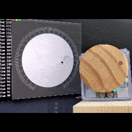

# DynamiKontrol

**You can be the alpha tester!**

DynamiKontol is Python API for controlling motors and hardware modules. You can integrate your Python code such as TensorFlow, PyTorch or OpenCV with hardwares.

## Getting Started

```
pip install -U DynamiKontrol
```

```python
from dynamikontrol import Module

module = Module()

module.motor.angle(angle=0)
time.sleep(2)

while True:
    # move 45 degree in clockwise
    module.motor.angle(angle=45)
    time.sleep(2)

    # move 45 degree in counter clockwise during 5000 milliseconds
    module.motor.angle(angle=-45, period=5000)
    time.sleep(5)
```

## Examples

| Example | Demo | Source Code |
| --- | --- | --- |
| Face Tracking Camera | [YouTube](https://youtu.be/AhYo2zR0xCU) | [Link](https://dynamikontrol.readthedocs.io/en/latest/face_tracking_camera.html) |
| A.I. Parking Barrier Gate |  | [Link](https://github.com/kairess/ANPR-with-Yolov4) |
| Lunch Roulette |  | [Link](https://dynamikontrol.readthedocs.io/en/latest/lunch_roulette.html) |
| Dial GUI |  | [Link](https://dynamikontrol.readthedocs.io/en/latest/dial_gui.html) |
| IoT Thermometer |  | [Link](https://dynamikontrol.readthedocs.io/en/latest/thermometer.html) |
| IoT Door Lock |  | [Link](https://dynamikontrol.readthedocs.io/en/latest/iot_door_lock.html) |

## Documentation

| Language | URL |
| --- | --- |
| English | https://dynamikontrol.readthedocs.io/en/latest/ |
| Korean | https://dynamikontrol.readthedocs.io/ko/latest/ |

---

Developed and designed by [The Matrix](https://www.m47rix.com) (c) 2021

matrix.ai.solution@gmail.com
