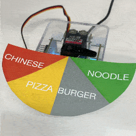

# DynamiKontrol

**If you want to buy this module, please email us matrix.ai.solution@gmail.com**

DynamiKontol is Python API for controlling motors and hardware modules. You can integrate into your Python code such as TensorFlow, PyTorch or OpenCV with hardwares easily.

Also you can control multiple DK modules on your PC, Raspberry Pi or NVIDIA Jetson.

<p align="center">
    
</p>

## Getting Started

```
pip install -U DynamiKontrol
```

```python
from dynamikontrol import Module

module = Module()

module.motor.angle(angle=0)
time.sleep(2)

while True:
    # move 45 degree in clockwise
    module.motor.angle(angle=45)
    module.led.on(color='r')
    time.sleep(2)

    # move 45 degree in counter clockwise during 5 seconds
    module.motor.angle(angle=-45, period=5)
    module.led.on(color='g')
    time.sleep(5)
```

## Examples

| Example | Demo | Source Code |
| --- | --- | --- |
| Face Tracking Camera | [YouTube](https://youtu.be/AhYo2zR0xCU) | [Link](https://dynamikontrol.readthedocs.io/en/latest/face_tracking_camera.html) |
| A.I. Parking Barrier Gate |  | [Link](https://github.com/kairess/ANPR-with-Yolov4) |
| Lunch Roulette |  | [Link](https://dynamikontrol.readthedocs.io/en/latest/lunch_roulette.html) |
| Dial GUI |  | [Link](https://dynamikontrol.readthedocs.io/en/latest/dial_gui.html) |
| IoT Thermometer |  | [Link](https://dynamikontrol.readthedocs.io/en/latest/thermometer.html) |
| IoT Door Lock |  | [Link](https://dynamikontrol.readthedocs.io/en/latest/iot_door_lock.html) |

## Documentation

| Language | URL |
| --- | --- |
| English | https://dynamikontrol.readthedocs.io/en/latest/ |
| Korean | https://dynamikontrol.readthedocs.io/ko/latest/ |

## Supported Devices

- PC/Laptop
- Raspberry Pi
- NVIDIA Jetson
- and all devices which support serial communication

### Operating System

- Windows
- MacOS
- Linux
- Ubuntu

## Block-Based Coding

Google's Blockly library makes it easier. Have fun with DynamiKontrol using interlocking blocks. (Support MacOS and Linux only. Windows comming soon)


https://thematrixgroup.github.io/?lang=en

---

- DynamiKontrol website https://dk.m47rix.com
- 구매 링크 https://smartstore.naver.com/dynamikontrol
- 네이버 카페 (질문과답변, 예제) https://cafe.naver.com/dynamikontrol

Developed and designed by [The Matrix](https://www.m47rix.com) (c) 2021

matrix.ai.solution@gmail.com
