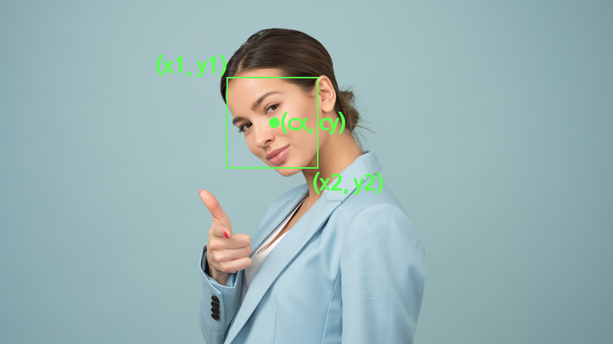

# Face Tracking Camera

Face tracking algorithm is not included in DynamiKontrol package. So we use [Mediapipe face tracking solution](https://google.github.io/mediapipe/solutions/face_detection) for face tracking and OpenCV for streaming webcam.

## Explanation



Let's define `x1`, `x2` are top left point and bottom right point of face bounding box, then `cx` would be center point of the face. Mediapipe face tracking solution returns relative coordinates of the input image, so range of `cx` would be 0.0 to 1.0. For instance, if your face is located in exact center of the image, `cx` is 0.5.

```python
cx = (x1 + x2) / 2 # center of the face

if cx < 0.4: # left -> clockwise
    angle += ANGLE_STEP
    module.motor.angle(angle)
elif cx > 0.6: # right -> counter clockwise
    angle -= ANGLE_STEP
    module.motor.angle(angle)
```

If `cx < 0.4`, face is located in the left of the image, camera should move to left, and it means the motor should move to clockwise(+). Otherwise vice versa.

## Source Code

```python
import cv2
import mediapipe as mp
from dynamikontrol import Module

ANGLE_STEP = 1

module = Module()

mp_drawing = mp.solutions.drawing_utils
mp_face_detection = mp.solutions.face_detection

face_detection = mp_face_detection.FaceDetection(
    min_detection_confidence=0.7)

cap = cv2.VideoCapture(0)
angle = 0 # motor current angle

while cap.isOpened():
    ret, img = cap.read()
    if not ret:
        break

    img = cv2.flip(img, 1) # mirror image

    results = face_detection.process(cv2.cvtColor(img, cv2.COLOR_BGR2RGB))

    if results.detections:
        for detection in results.detections:
            mp_drawing.draw_detection(img, detection)

            x1 = detection.location_data.relative_bounding_box.xmin # left side of face bounding box
            x2 = x1 + detection.location_data.relative_bounding_box.width # right side of face bounding box

            cx = (x1 + x2) / 2 # center of the face

            if cx < 0.4: # left -> clockwise
                angle += ANGLE_STEP
                module.motor.angle(angle)
            elif cx > 0.6: # right -> counter clockwise
                angle -= ANGLE_STEP
                module.motor.angle(angle)

            cv2.putText(img, '%d deg' % (angle), org=(10, 30), fontFace=cv2.FONT_HERSHEY_SIMPLEX, fontScale=1, color=255, thickness=2)

            break

    cv2.imshow('Face Cam', img)
    if cv2.waitKey(1) == ord('q'):
        break

cap.release()
face_detection.close()
module.disconnect()
```