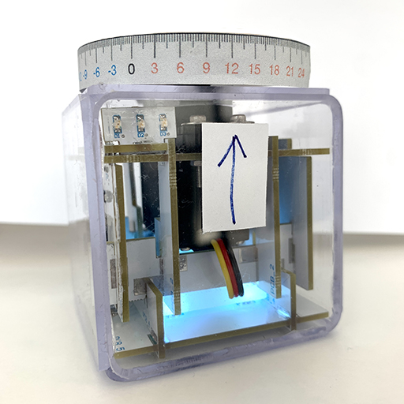

# Thermometer

Simple IoT analogue thermometer using weather API. It is around 13 degrees Celsius in the image below.



You can download a graduated ruler from this link.

https://github.com/TheMatrixGroup/DynamiKontrol/raw/master/examples/thermometer.pdf

## Source Code

```python
from dynamikontrol import Module
import requests, time
from datetime import datetime

module = Module()

# weather of Seoul, Korea
lat = 37.566536  # latitude
lon = 126.977966 # longitude
url = f'https://fcc-weather-api.glitch.me/api/current?lat={lat}&lon={lon}'

while True:
    res = requests.get(url).json()
    temp = res['main']['temp']

    print(f'{datetime.now()} temperature {temp} degree')

    angle = int(temp * 10 / 3)
    module.motor.angle(angle)

    time.sleep(60)

module.disconnect()
```